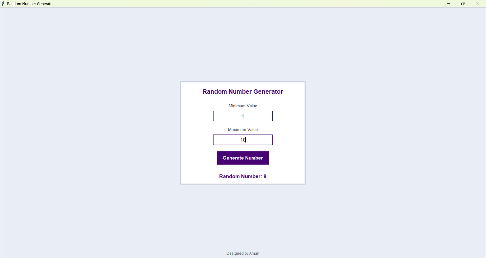

# 🎲 Randomizer – Random Number Generator (Tkinter)

## 📘 Overview
**Randomizer** is a simple yet powerful **Random Number Generator** application built using **Python Tkinter**.  
It allows users to generate random numbers within a specified range using a clean and modern graphical interface.  
Perfect for students, developers, and anyone who needs quick and accurate random number generation.

---

## 🚀 Features
- 🔢 Generate random numbers instantly  
- ⚙️ Set minimum and maximum range values  
- 🎨 Modern and responsive Tkinter GUI  
- 🧠 Error handling for invalid inputs  
- 💡 Lightweight and easy to use  

---

### Output

---

## 🧰 Tech Stack
- **Language:** Python  
- **GUI Library:** Tkinter  
- **Randomization:** Python `random` module  

---

## ⚙️ Installation and Setup
1. Clone this repository:
   git clone https://github.com/amanchougule09/Randomizer-using-TKinter.git
   
3. Navigate to the project folder:
   cd Randomizer-using-TKinter

Run the script:
python Randomizer.py

💡 Use Case

Ideal for:
Students learning Python GUI development
Developers who need random testing data
Teachers creating number-based learning tools

👨‍💻 Author
  Aman Chougule
